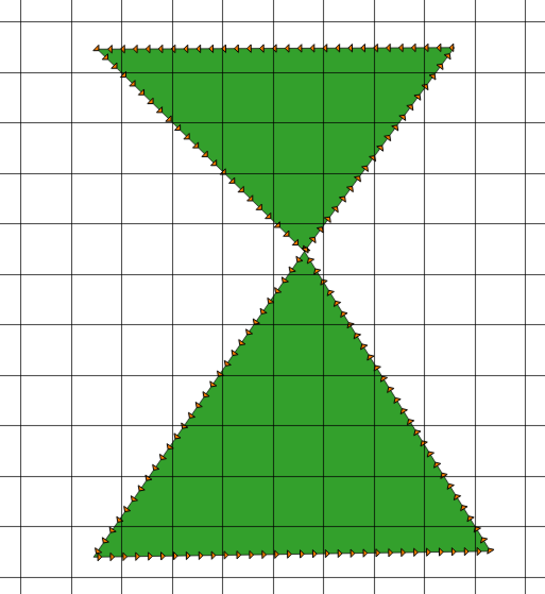
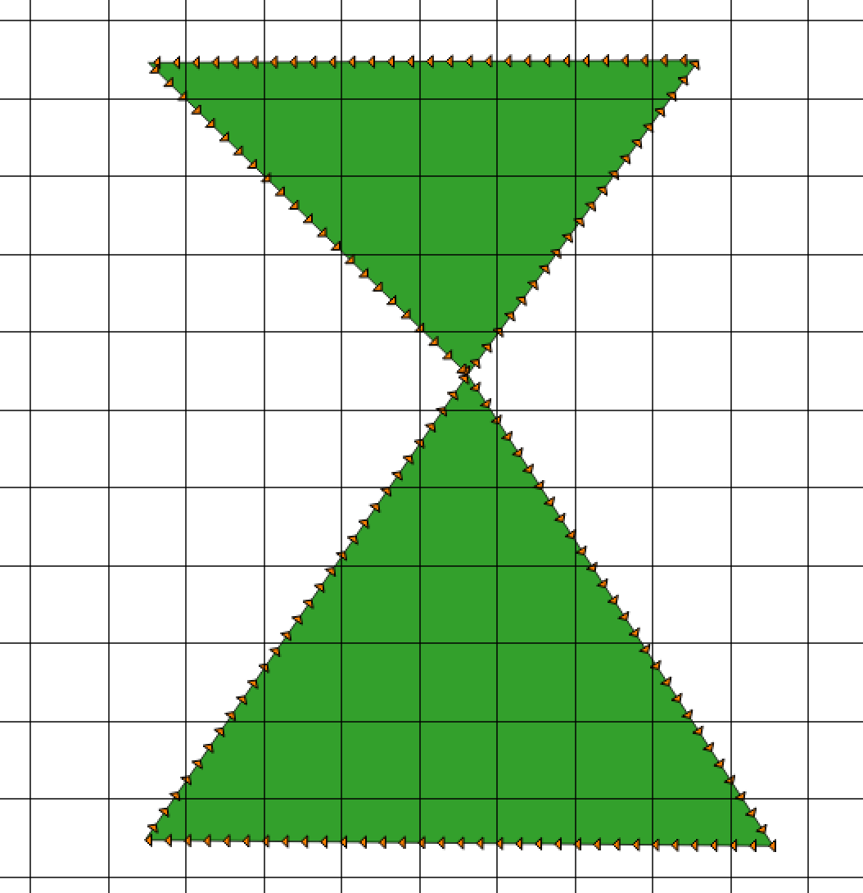
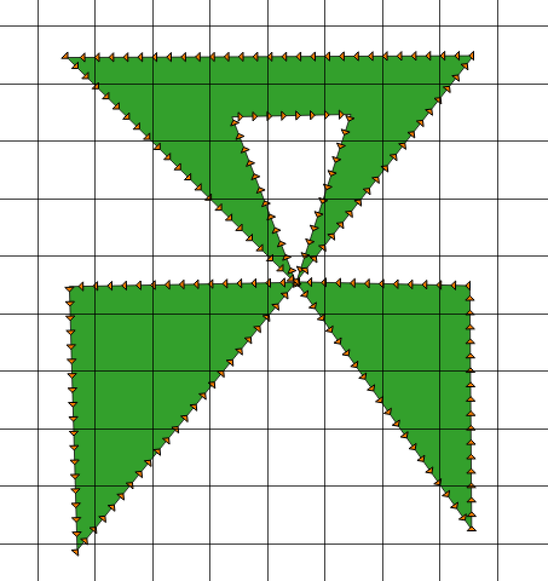
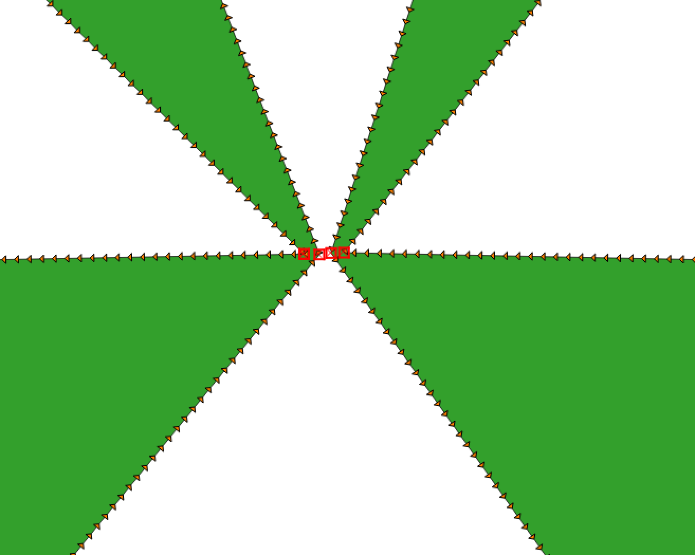
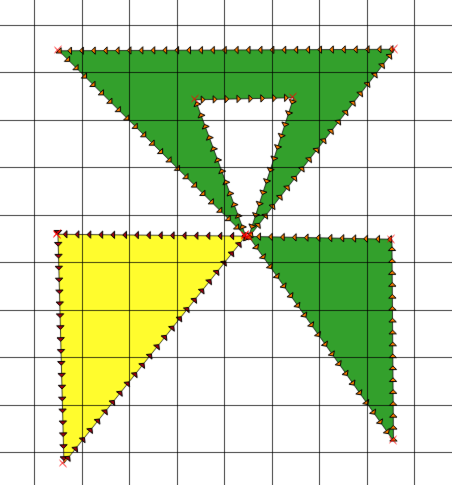
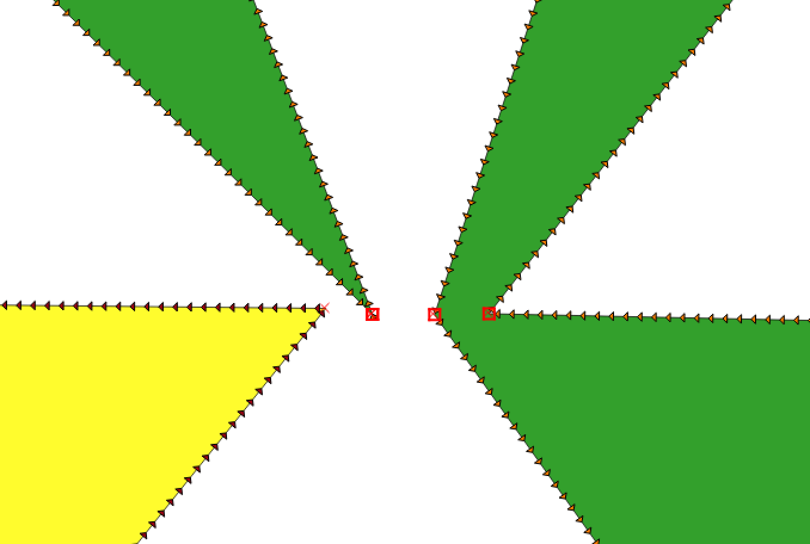
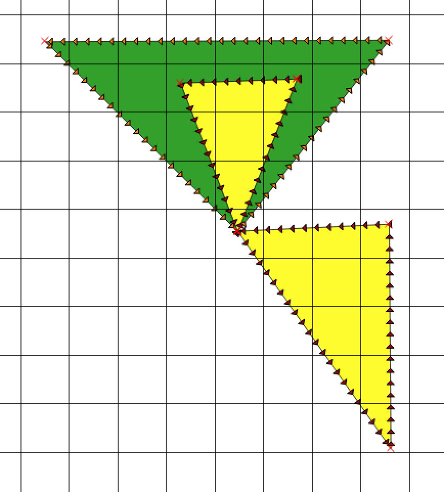

## Intersections

Intersections of points will be found after the vatti processing. Every point will be part of a ring at this point and no ring will overlap another ring. It is the job of the topology correction code to take the existing rings and handle the different intersections to make valid and simple polygons.

### Types of Intersections

The following are the types of intersections that can occur

* Intersection of points on the same ring
* Intersetion of an exterior ring with another exterior ring
* Intersection of an exterior ring with an interior ring
* Intersection of an interior ring with another interior ring

### Self Intersection

A self intersection is an instance where two points belong to the same ring. Each time this occurs a section of the ring will become a new ring.

#### The Fundamental Assumption of Intersections

The resulting rings from the vatti processing are **guaranteed** to never result in the path of a ring crossing with itself. While the path might be collinear or share intersection points that need to be cleaned up, it does not ever result in an "crossing intersection".

The image below shows a single ring - this is *not* a crossing intersection because the pairing of any two segments (one being towards, one being away) does not result in the path crossing over itself.



The next image however is an example of a crossing intersection. 



Notice how no pair of towards and away paths can be selected such that the paths do not cross. This will not occur with the output from vatti and we must ensure it does not happen in the topology correction processing. If a crossing self intersection were to occur during our spliting process it would cause the winding order of the expected output to be *reversed*. This would greatly complicate ring determination, so we must avoid this from occuring.

#### Complex Self Intersections

Very complex self intersections can likely occur were *more then 2* paths through the point. The following is an example of where this can occur.



While this is not a crossing self intersection intially we must take care with the order of the processing of the paths. Splitting a ring into two distinct rings is the critical part of self intersection processing and *if an intersection is crossing the two resulting rings will be crossing each other such that one ring could be partial inside the other*. This makes it **MUCH** more difficult to properly determine parent child relationship of the resulting rings.

#### What Does Self Intersection Processing Do?

It is difficult to visualize the original path with out "spreading out" the points that intersect ever so slightly, lets explore the processing of the complex self intersection that was shown above.



Assuming that we labeled each of the intersection points from left to right in the picture above as `A, B, C, D`. Lets explore how the order of the self intersection processing can result in intersections.

At its core self intersections are corrected by swapping where each intersection point will travel to next. The code for it is something like this:

```
    // split the polygon into two ...
    point_ptr<T> op3 = op->prev;
    point_ptr<T> op4 = op2->prev;
    op->prev = op4;
    op4->next = op;
    op2->prev = op3;
    op3->next = op2;
```

Basically the directions of the paths are switched. If we processed `A` and `B` together from our example above, first it will result in the creation of a new ring as shown below:



This is proper because the resulting two rings -- are either **completely within or completely outside of the other ring**. Notice as well that when we zoom in there are still no crossing intersections.



However, lets say we attempt now to process `B` and `D`. Hint: This is not what we want to do!



Notice that suddenly the new polygon created is both inside and outside the original polygon. This means the ring is both a hole and not a hole!

#### Proper Path Processing for Complex Intersections

In order to prevent this from occuring, self intersections should only be performed between any two paths selected for another intersection where there is no other path that would bisect them! To determine a proper pair of paths for self intersection, the angles of each of the segment of a path are sorted in relation to a single path. Due to the fact that no paths will be crossing, we can first sort all other paths as either on the left or right side of the path. After this all paths on each side are sorted by those that are closest to farthest from one segment on our source path. This allows us to find the path that is closest to the first path selected.

If we process all paths of the self intersection in this method until no intersections remain, we will always produce valid rings.
