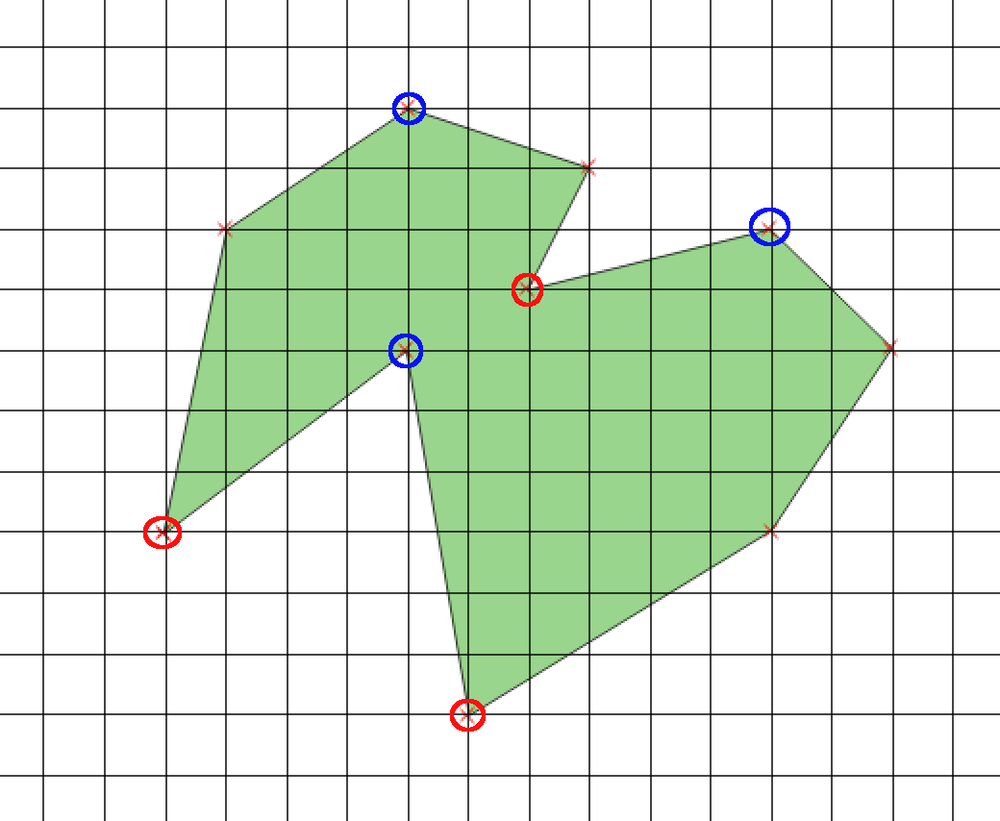

## Vatti Algorithm

There is an excellent book that contains a great description of a Vatti algorithm. For more information
then the information provided here on the Vatti algorithm, please look into this book.

```
Computer graphics and geometric modeling: implementation and algorithms
By Max K. Agoston                                                      
Springer; 1 edition (January 4, 2005)
```

A very simple explanation of the the Vatti algorithm is that it breaking apart rings into line segments (edges) - decides what part of edges to keep, and then re-assembling the resulting rings.

### Edges

An edge is a line formed between two points on a ring. This might also be called a line segment within this documentation. 

### Local Minimum and Local Maximum

The first part in understand Vatti is the concepts of local minima and local maxima. Local minima are points on a ring where both of the line segments from the point connect to values that are "below" the minima point, such that no other local minima will be located until a local maxima is found. 

That all sounds a bit complicated but a picture will clear it up quickly. Consider the ring below where the local minima are circled in blue and the local maxima are circled with red. 



Horizontal segments complicate this a little, but keep in mind that no local mimima can be followed by another local minima as you travel around a ring. 

### Bounds

A bound is a series of edges, that start at a local mimimum and end at a local maximum. Every local minimum on a ring has two bounds, a left bound and a right bound. Lets locate the bounds from the ring shown above - left bounds are colored red and right bounds are colored in blue.


You can see the start and end of the bounds by the direction the arrow travels, starting at a local mimima and traveling to a local maximum. 

Bounds are important in the vatti algorithm because they share a common set of data, such as a winding delta and winding count!
